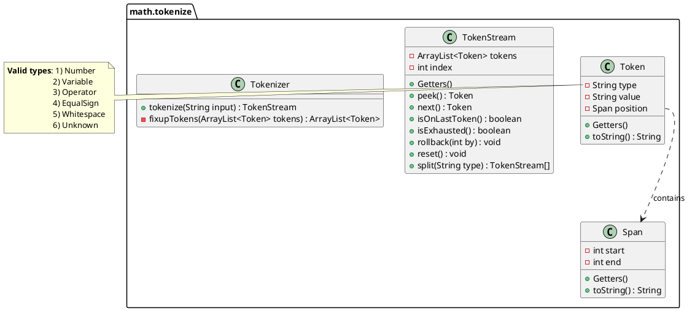
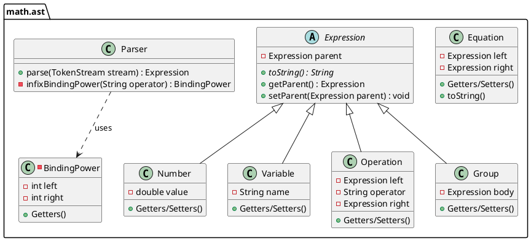

# Implementation Notes: runthenumbers.math

> [!NOTE]
> A basic Python calculator has already been written with tokenization,
> parsing, and evaluation functionality, thus a large part of the Java
> implementation is simply a port of the Python code. The solving,
> quality-of-life, and variable features are new, however.

```plantuml
start
:Math Input;
:Initial tokenization;
:Apply adjustments to tokens;
:Validate token stream;
:Parse into AST;
stop
```

## Expression tokenization

The Python implementation was inspired by <https://docs.python.org/3/library/re.html#writing-a-tokenizer>.

At a high level, the tokenizer splits the input text into its constituent tokens
by searching for specific text patterns via [regular expressions] (regexes).
Despite their uncomplicated name, regexes are not trivial.

> The summary is that a regular expression is a special matching format.
> Alphanumeric characters are matched literally. The regex `dog` would only
> match the string `dog` literally. The power of regex from the extensive
> syntax available to fine tune the match.
>
> Adding a `*` after a character allows for zero-to-infinite occurances of
> that character. A `?` makes the preceding character optional. Square brackets
> denote a character range, i.e., select one instance of a set of characters.
>
> - `dog*` would match `dog`, `doggg`, or even `dogggggggggggg`
> - `dogs?` would match `dog` or `dogs` but NOT `dogss`
> - `dog[a-z]` would  match `dogA`, `dogB`, `dogZ`, but not `dog0` or `dogAA`
>
> Round brackets denote groups that must match entirely. `*`, `?` and the
> many other constructs available can apply to groups as well.
>
> To match an integer or decimal number, this (oversimplified) regex could be used:
> `[0-9]+(\.[0-9]+)?`
>
> Breaking it down, it will match if:
>
> - The string starts with one or more digits (`[0-9]+`)
> - The string is terminated OR ends with:
>   - A literal dot (`\.` - as an unescaped dot matches any character),
>     followed by one or more digits (`[0-9]+`)
>
> There are many more special regex constructs available, but I don't want to be
> here all day explaining them.

For a math expression, tokenization may look like this:

```
5 * (2 + 2)
| | | and so on... 
| | |
| |  > Left bracket
|  > Operator
 > Number
```

Or in pseudocode:

```
REGEX = NUMBER_REGEX OR OPERATOR_REGEX OR ...

TokenStream tokenize(String input) {
    ArrayList<Token> tokens = []
    for (match : regex.search(input)) {
        if match.type is "Whitespace"
            continue  // we don't care about whitespace tokens
        else if match.type is "Unknown"
            throw MathParseError
        
        tokens <- new token object of type "match.type"
    }
    return new TokenStream(tokens)
}
```

As shown in the code, some tokens are special. `Whitespace` tokens are produced
(so the tokenization doesn't crash if there is extra whitespace) but they
are thrown away. There is an also a `Unknown` token type that is produced if
none of the other token patterns match. If an `Unknown` token is encountered,
raise an error.

The list of tokens are stored within a `TokenStream` which is a light wrapper
class for ease of use in the parser. Like a read-only file, the stream keeps
track of what token is is under the "read head". The parser can `peek()` at
the next token without advancing or the parser can read the `next()` token
and advance to the next token. Peeking is necessary as parsing may change
depending on what's the next token (e.g., did we encounter a new left bracket?)

### Fix-ups & error handling

While the regexes does a good job at chunking the input into the right
tokens, adjustments to the token list may be required.

For example, the expression `2-2` will—as numbers are tokenized
first—tokenize to a `Number(2)` followed by `Number(-2)`.

```python
>>> tokenize("2-2")
[Token(kind='Number', value='2', pos=(0, 1)),
  Token(kind='Number', value='-2', pos=(1, 3))]
```

This is evidently incorrect. The actual token stream should be `Number(2)`,
`Operator(-)` followed by `Number(2)`.

To allow for a broader range of input (without complicating the already
confusing parser), the following adjustments will be performed:

1. Add a subtraction `Operator` in-between adjacent `Number` tokens
   where the second token is negative.

    ```
    Input: 1-2
    Original tokens: Number(1), Number(-2)
    Fixed tokens: Number(1), Operator(-), Number(2)
    ```

1. Add a multiplication `Operator` in-between adjacent opening and closing
   brackets.

   ```
   Input: (5)(2)
   Original tokens: Parenthesis, Number(5), Parenthesis, Parenthesis, Number(2), Parenthesis
   Fixed tokens: Parenthesis, Number(5), Parenthesis, Operator(*), Parenthesis, Number(2), Parenthesis
   ```

1. Replace pairs of `Number` + `Variable` tokens with `Number`,
   `Operator(*)`, and `Variable`.

   ```
   Input: 5x
   Original tokens: Number(5), Variable(x)
   Fixed tokens: Number(5), Operator(*), Variable(x)
   ```

After all fix-ups have been done, if any of the following issues still
exist, a parse error will be raised:

- Adjacent `Number`s
- Adjacent `Operator`s
- ~~Imbalanced parenthesises~~ (likely tedious, deferred for later)
- A `Operator` that is not followed by a `Number`, `Variable`,
  or opening `Parenthesis`
- Multiple `EqualSign`s

The post-processing step shall operate vaguely in this way:

```python
# For adjacent-related adjusments.
for index in [0, stream.size):
    first = stream[index]
    second = stream[index+1]
    if (first, second) match (expected, expected2):
        stream.insert(index, extra token)

# For multiple equal signs.
if stream.count("=") > 1:
    raise ParseError
```

### UML Diagram



## Expression parsing

Parsing is the step that turns a list of tokens into a tree (specifically,
an [abstract syntax tree]) that represents the math expression. The tree
structure is important so operator precedence and parenthesizes are respected.

I'm not going to even try to explain the algorithm used here. My original Python
implementation is (probably, I can't recall) a direct port of the Pratt parsing
algorithm for math expressions described here:
<https://matklad.github.io/2020/04/13/simple-but-powerful-pratt-parsing.html>

The base Java implementation is a port of my Python port, **but it has been
extended to handle variables and equations (aka the equal sign)**.

Implementation-wise, there are the root `Expression` and `Parser` classes. The
available expressions are represented using sub-classes of `Expression`.
Expressions can be nested within each other. An `Operation` expression must
contain two `Expression` instances (left/right sides) and a string (the
operator).

### Extensions to my Python port

As stated above, the Java port needs to be extended to include support for
variables and equations.

To handle equations, if (the newly added) `EqualSign` token is found, the
token stream shall be split into two and the two streams are parsed
independently.

```python
def parse(stream: TokenStream):
    if stream contains "=":
        left_stream, right_stream = stream.split("=")
        left_expr = parse(left_stream)
        right_expr = parse(right_stream)
        return Equation(left_expr, right_expr)

    elif stream does not contain "="
        # <perform parsing magic>
```

To handle variables, merely a new `Variable` token type needs to be added.
See the UML diagram for more information.

### UML Diagram



[regular expressions]: https://en.wikipedia.org/wiki/Regular_expression
[abstract syntax tree]: https://en.wikipedia.org/wiki/Abstract_syntax_tree

## Equation Solving

> [!IMPORTANT]
> There are certainly proper/efficient algorithms for solving equations out
> there, but I wanted to challenge myself to devise one that could handle
> basic equations. The solving functionality will consequently be quite
> limited.

### UML Diagram

```plantuml
set separator none
package math.solve {
  class Solver
  class LinearSolver
  class QuadraticSolver
  class Simplifier
}

abstract class Solver {
  {abstract} canSolve(Equation eqn) : boolean
  {abstract} solve(Equation eqn) : boolean
}
class LinearSolver extends Solver {}
class QuadraticSolver extends Solver {}

class Simplifier {
    +simplify(Expression expr) : Expression
    +simplify(Equation eqn) : Equation
    -simplifyNode(Expression expr) : Expression
    -combineLikeTerms(Expression expr) : void
    -findLikeTerms(Expression expr) : ArrayList<Operation> 
    -distributeTerms(Expression expr) : Expression
}
```

### Linear single variable solving

To solve linear single variable equations, the calculator needs to be taught
a handful of elementary solving techniques. To start, the solver will be able
to perform:

- Inverse operations
- Collection of like terms
- ~~Distribution~~ (likely difficult, deferred for later)
- ~~Expansion~~ (likely difficult, deferred for later)

These actions will be then applied in a loop until the variable is isolated
on one side.

For expressions containing brackets, the workaround is to aggressively
simplify the expression. Once there are no brackets left, the equation can
be solved as described above. If brackets still remain after simplification,
then solving those is left as a reach goal.

It's easier to explain the algorithm using an activity diagram than with
pseudocode.

```plantuml
start
while (Left/right side can be simplified?)
  :Simplify side;
  fork
    :Collect like terms;
  fork again
    :Expand;
  fork again
    :Distribute;
  endfork
endwhile

while (Is variable isolated?) is (no)
  :Apply inverse operation;
endwhile

:Return variable = <value>;
stop
```

### Detour: Simplification

To make the solver's life easier, the equation will be simplified as
much as possible. The goal to only have a handful of operations on the
side with the variable.

As mentioned earlier, the simplifier should ideally be able to:

- Fold operations with constant operands (i.e., a constant answer)
- Collect like terms (add/subtract, consecutive multiplication)
- Distribute a term over brackets
- ~~Expansion~~ (likely difficult, deferred for later)

The first two parts of the simplification logic will broadly look like this:

```python
def simplify_node(expr: Expression):
    # Returns a simplified version of expr if possible.

    # Walk expression AST recursively for operations that contains
    # constant operands. Matching operations are replaced with
    # number nodes.
    if expr is Operation:
        simplify operation.left
        simplify operation.right
        if expr contains only constant operands:
            # Replace this expression with a number node.
            return Number(evaluate(expr))

    elif expr is Group
        simplify group.body
        if group.body is Number:
            # Eliminate the group as it simplifies down to a constant.
            return group.body
    
    combine_like_terms(expr)
    return expr

def combine_like_terms(expr: Expression):
    if expr is Group:
        # We're combining terms within brackets, but we don't care
        # about the brackets specifically.
        expr = expr.body

    # Addition/subtraction are associative, thus we can collect and
    # fold their constant operands into a single Number.
    like_terms = find_like_terms(expr)
    first_number = get_number_node of like_terms[0]
    for term_operation in like_terms:
        number_node = get_number_node of term_operation
        first_number.value += number_node.value
        # <remove number_node (and its containing operation node)
           # from tree as necessary>

def find_like_terms(expr: Expression):
    # Look for operations which have one constant operand.
    add_subtract_terms = []
    if expr is Operation and expr.operation is ADD or SUB:
        add_subtract_terms += find_like_terms of expr.left AND expr.right
        add_subtract_terms.append(expr constant operand)

    elif expr is Group
        # Within brackets, thus terms cannot be combined so don't
        # even look for candidate terms.
        return []
```


### Quadratic single variable solving

TBD.
